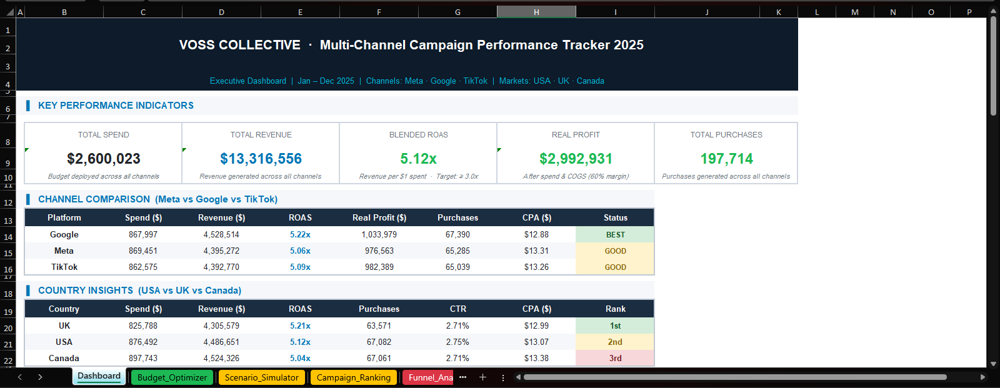
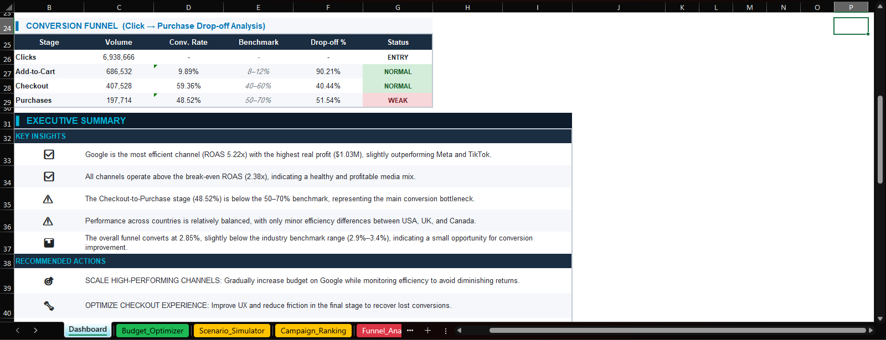
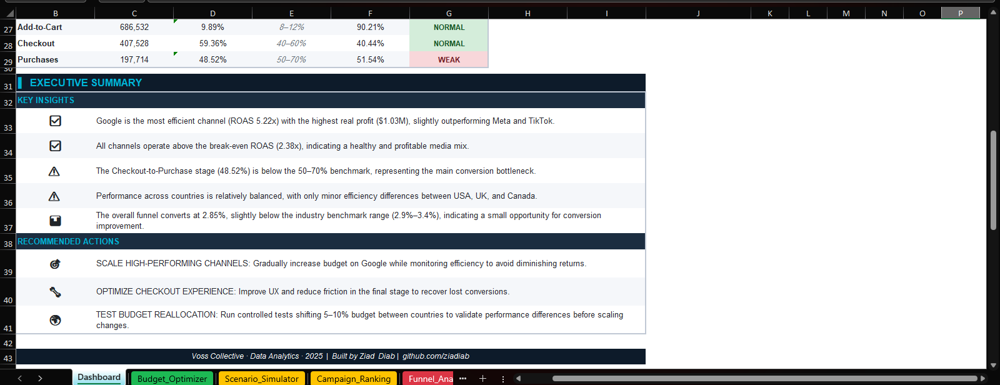
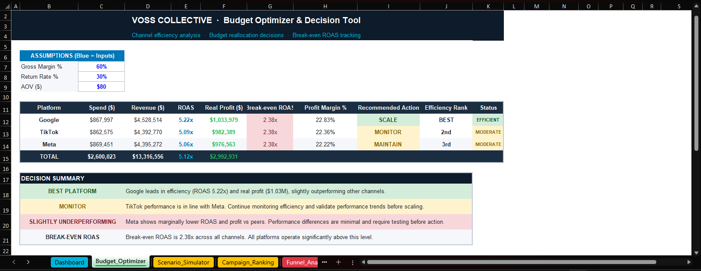
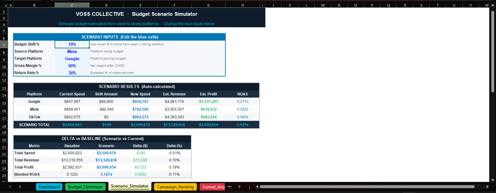
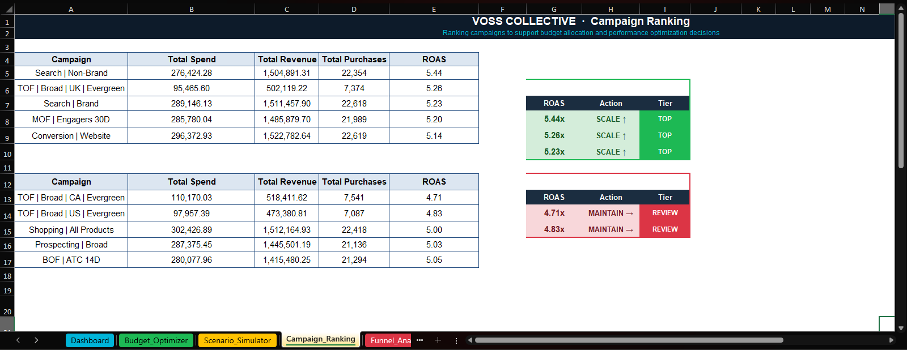
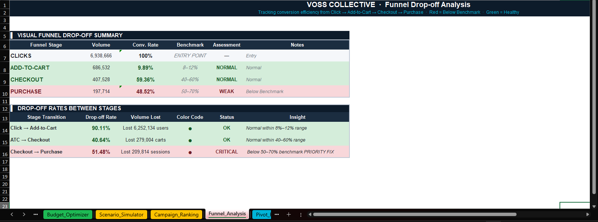

# Multi-Channel Marketing Analytics & Budget Optimization (E-commerce | DTC)

An end-to-end **Excel-based marketing analytics system** built to analyze campaign performance, identify funnel inefficiencies, and optimize budget allocation across multiple channels.

---

# Business Context

**Brand:** Voss Collective *(Simulated)*
**Industry:** Streetwear Fashion E-commerce *(mid-tier — not luxury, not low-cost)*
**Business Model:** Direct-to-Consumer (DTC, Shopify-like store)
**Markets:** United States, United Kingdom, Canada
**Timeframe:** Full-year performance analysis (Jan – Dec 2025)

> **Disclaimer:**
> This project uses a **fully simulated dataset and fictional brand** created for portfolio purposes.
> The goal is to demonstrate real-world marketing analytics and decision-making skills.

---

# Executive Summary

Voss Collective invested **$2.6M across Google, Meta, and TikTok**, generating:

* **$13.3M revenue**
* **5.12x blended ROAS**
* **$2.99M estimated real profit**
* **197K total purchases**

Despite strong performance, analysis uncovered:

* **Major funnel drop-off at Checkout → Purchase (48.52% vs 50–70% benchmark)**
* **Uneven efficiency across channels and markets**
* Missed profit opportunities due to suboptimal allocation

### Business Impact

* Identified opportunity to **increase profit via 10–15% budget reallocation**
* Estimated **+$5K to $50K incremental profit potential**
* Highlighted **checkout optimization as the highest ROI lever**

---

# Business Problem

How can we:

* Maximize **real profitability (not just ROAS)**?
* Identify **where customers drop in the funnel**?
* Allocate budget across **channels & markets more efficiently**?

---

# 🧠 Methodology

This project combines multiple analytical approaches:

* Funnel Analysis (Click → Purchase)
* KPI Benchmarking (Industry standards)
* Channel & Country Performance Comparison
* Scenario Simulation (What-if analysis)
* Budget Optimization Modeling

---

# Tools & Skills

### Excel

* Pivot Tables
* Advanced Formulas
* KPI Modeling
* Scenario Simulation

### Analytics Skills

* Marketing Analytics
* Funnel Analysis
* Budget Optimization
* Data Storytelling
* Business Decision Support

---

# Dashboard Preview

## Executive Dashboard






---

## Budget Optimizer & Decision Tool



---

## Scenario Simulator (What-if Analysis)



---

## Campaign Ranking (Top vs Worst)



---

## Funnel Drop-off Analysis



---

# Key Insights

### 1. Channel Performance

* **Google = top-performing channel (ROAS 5.22x, $1.03M profit)**
* Meta & TikTok perform closely but with slightly lower efficiency

---

### 2. Funnel Bottleneck 

* Checkout → Purchase = **48.52% (below 50–70% benchmark)**
* Largest leakage point in the entire customer journey

---

### 3. Overall Conversion Efficiency

* Funnel CVR = **2.85%**
* Slightly below benchmark (2.9%–3.4%)

---

### 4. Market Performance

* US, UK, Canada performance is relatively balanced
* Minor inefficiencies suggest optimization potential

---

# Business Recommendations

### 1. Fix Checkout Drop-Off (HIGH IMPACT)

* Improve UX, payment options, trust signals
* Even +5% improvement = significant revenue increase

---

### 2. Reallocate Budget Strategically

* Shift budget toward top-performing channels (Google)
* Avoid over-scaling to prevent diminishing returns

---

### 3. Run Controlled Experiments

* Test **5–10% budget reallocation scenarios**
* Validate before scaling

---

# Scenario Simulation (What-if Analysis)

Simulated budget shift:

* From: Meta
* To: Google

### Result:

* Increase in estimated revenue and profit
* Slight improvement in blended ROAS

Demonstrates **data-driven decision-making**

---

# Project Structure

```bash
data/
   └── voss_collective_final.xlsx

assets/
   ├── dashboard.png
   ├── dashboard_2.png
   ├── dashboard_3.png 
   ├── budget_optimizer_4.png
   ├── scenario_simulator_5.png
   ├── campaign_ranking_6.png
   └── funnel_analysis_7.png
```

---

# Limitations

* Simulated dataset (not real company data)
* No user-level granularity (aggregated metrics only)
* No attribution modeling (assumes simplified attribution)

---

# Next Steps

If implemented in a real business:

* Build **Power BI dashboard for real-time tracking**
* Add **customer-level analysis (LTV, retention, cohorts)**
* Run **A/B tests on checkout flow**
* Integrate **CAC vs LTV modeling**

---

# Author

**Ziad Diab**
Marketing Analyst | E-commerce Data Analyst

---

# ⭐ If you found this useful, consider giving it a star!
